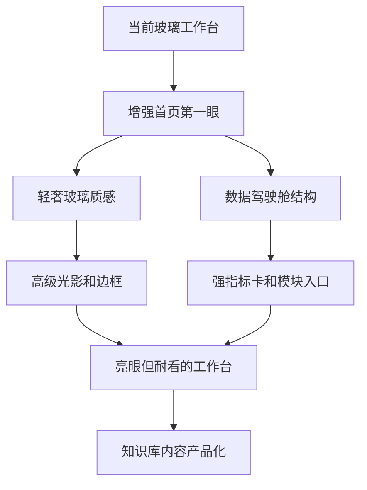

# 视觉风格方向细化方案

> 当前阶段只做方向细化，不修改实现代码。目标是在动手改 [`theme-glass.css`](../theme-glass.css)、[`styles.css`](../styles.css)、[`index.html`](../index.html) 之前，先确定页面要呈现的视觉性格，避免做成单纯“更花”的界面。

## 1. 当前页面视觉判断

基于现有结构与样式，当前界面已经有玻璃拟态基础，但“第一眼吸引力”不足，主要原因不是功能少，而是视觉层级和情绪价值不够强。

| 区域 | 当前问题 | 可优化方向 |
|---|---|---|
| 首页顶部概览 [`dashboard-overview`](../index.html:111) | 信息是平铺的，缺少主视觉中心 | 加强 Hero Dashboard，建立第一屏视觉锚点 |
| 指标卡片 [`overview-card`](../index.html:119) | 数字存在感不足，缺少增长感和能量感 | 增加高亮数字、渐变底、光晕、图形纹理 |
| 模块卡片 [`module-card`](../styles.css:1900) | 卡片偏工具化，吸引力弱 | 做成更强的玻璃卡、悬浮卡、内容入口卡 |
| 顶部导航 [`header`](../index.html:71) | 识别度一般，品牌感不强 | 加入更鲜明的顶部光带、胶囊导航、状态氛围 |
| 知识库列表 [`knowledge-view`](../index.html:231) | 偏普通列表，产品化不足 | 让笔记像内容产品卡片，强化标签和摘要 |
| 全局背景 [`body::before`](../theme-glass.css:77) | 背景遮罩比较克制，情绪不够 | 加环境光、径向渐变、局部流光背景 |

## 2. 五种可选视觉路线

### 方案 A：科技霓虹 Cyber Glass

**关键词**：蓝紫霓虹、深色背景、强光晕、数字驾驶舱、未来感。

**适合目标**：想要页面一打开就明显“炫”“亮眼”“像大屏系统”。

**视觉表现**：

- 背景加入蓝紫色径向光斑和轻微网格纹理。
- 首页指标卡变成强对比发光卡，数字使用更大的字号和渐变文字。
- 模块卡片 hover 时有蓝紫描边和上浮阴影。
- 顶部导航增加霓虹细线和激活态发光。
- 知识卡片使用暗色玻璃和高饱和标签。

**优点**：第一眼冲击力最强，最符合“更亮眼”。

**风险**：如果光效过多，容易显得花哨；长时间使用可能疲劳。

**适配建议**：适合作为“展示型首页”或偏科技工作台的视觉方向。

---

### 方案 B：轻奢玻璃 Premium Glass

**关键词**：高级玻璃、柔和光晕、蓝金点缀、通透、精致。

**适合目标**：既要亮眼，又不能廉价花哨；希望更像成熟产品。

**视觉表现**：

- 保留现有玻璃拟态基础，在卡片边缘加入更细腻的高光。
- 主色以冰蓝为主，辅以少量香槟金或紫色点缀。
- 首页概览做成通透 Hero 区，背景有柔和光斑，不做强烈赛博网格。
- 指标卡片增加内发光、角标、微渐变，但控制饱和度。
- 知识库卡片更像 Notion + Apple 风格的内容卡。

**优点**：耐看、精致、适合长期作为工作台使用。

**风险**：冲击力不如方案 A 强，需要通过布局和细节体现高级感。

**适配建议**：最适合当前项目，能在现有 [`theme-glass.css`](../theme-glass.css) 基础上最小改动升级。

---

### 方案 C：数据驾驶舱 Executive Dashboard

**关键词**：KPI、仪表盘、运营大屏、信息密度、强首页。

**适合目标**：希望首页一眼像“管理驾驶舱”，突出工作台价值。

**视觉表现**：

- 首页最上方改成强 Hero Dashboard，突出总模块、知识笔记、本周新增、待办等核心指标。
- 指标卡加入趋势箭头、微型图形、背景纹理。
- 模块区域更像系统入口矩阵，每个模块像一个业务面板。
- 右侧最近活动做成时间线或动态日志。
- 待办区域强调优先级、日期、状态统计。

**优点**：结构清晰，页面价值感强，不只是“漂亮”。

**风险**：如果做得太像企业后台，可能少一点情绪美感。

**适配建议**：可与方案 B 组合，形成“轻奢玻璃 + 数据驾驶舱”的主路线。

---

### 方案 D：极简高级 Minimal Pro

**关键词**：留白、细线、低饱和、克制、高级效率工具。

**适合目标**：更重视长期使用舒适度，不追求强烈炫光。

**视觉表现**：

- 减少复杂渐变和大面积光晕。
- 强化字体层级、间距、圆角、边框、阴影一致性。
- 卡片以低透明度玻璃和精细描边为主。
- 数字和标题更克制，使用少量品牌色点亮。
- 知识库更像专业文档管理工具。

**优点**：耐看、专业、不容易审美疲劳。

**风险**：不一定满足用户说的“不够亮眼”的核心诉求。

**适配建议**：不建议作为第一阶段主方向，可作为视觉克制度的参考。

---

### 方案 E：内容产品化 Knowledge Product

**关键词**：内容卡片、专题感、标签体系、知识产品、阅读吸引力。

**适合目标**：如果知识库是当前网页最重要的吸引点，就优先强化知识页面。

**视觉表现**：

- 知识笔记从普通列表升级成精选卡片流。
- 卡片突出标题、摘要、标签、更新时间、分类色。
- 顶部增加知识库 Banner 和搜索聚焦区。
- 重要笔记可以做“精选”“最近更新”“本周新增”视觉分组。
- Markdown 内容详情页强化阅读排版。

**优点**：能显著提升知识库页面吸引力和内容感。

**风险**：如果只改知识库，首页第一眼仍可能不够亮。

**适配建议**：适合作为第二阶段，在首页视觉确定后继续优化。

## 3. 推荐主路线

我建议不要单选极端方案，而是采用：

**主路线：方案 B 轻奢玻璃 Premium Glass + 方案 C 数据驾驶舱 Executive Dashboard**

辅以少量方案 A 科技霓虹的光效，但控制强度。

### 推荐原因

1. 当前项目已经有玻璃拟态基础，沿着方案 B 升级成本最低，视觉一致性最好。
2. 用户明确要“亮眼、吸引人”，方案 C 可以通过首页 Hero 和指标卡快速建立吸引力。
3. 只用方案 A 容易过炫，长期使用不耐看；B + C 更稳。
4. 方案 E 可以作为第二阶段补充，提升知识库页面的内容吸引力。

## 4. 推荐落地效果描述

最终页面应该是：

- 第一眼看到的是一个有层次、有光感、有数据重点的首页工作台。
- 背景有氛围，但不抢内容。
- 卡片更通透，边缘有高级高光，不是普通白卡。
- 数字指标更醒目，有类似产品 Dashboard 的“价值感”。
- 模块入口更像精致应用入口，而不是普通列表容器。
- 知识库更像内容产品，而不是表单页面。

## 5. 分阶段视觉落地建议

| 阶段 | 目标 | 主要范围 | 不做内容 |
|---|---|---|---|
| 第一阶段 | 让首页第一眼亮起来 | [`dashboard-overview`](../index.html:111)、[`overview-card`](../index.html:119)、全局背景、顶部导航 | 不改业务逻辑 |
| 第二阶段 | 让模块区更像产品入口 | [`module-card`](../styles.css:1900)、模块标题、内容入口、hover 效果 | 不重构模块渲染 |
| 第三阶段 | 让知识库更有内容吸引力 | [`knowledge-view`](../index.html:231)、知识卡片、标签、详情排版 | 不改同步逻辑 |
| 第四阶段 | 加强细节质感 | 动效、按钮、空状态、弹窗、滚动条 | 不引入新依赖 |

## 6. 风格强度选择

为了避免后续执行时偏差，需要先确定“亮眼程度”。

| 强度 | 描述 | 适合情况 |
|---|---|---|
| 轻度 | 只加强光影、卡片和数字，不明显改变整体气质 | 想稳妥升级 |
| 中度 | 首页明显变亮眼，卡片、背景、导航都有产品化升级 | 推荐选择 |
| 高度 | 强霓虹、强光效、强驾驶舱感 | 想要展示效果优先 |

推荐选择：**中度**。

## 7. 色彩建议

### 推荐色板

| 用途 | 色彩 |
|---|---|
| 主色 | 冰蓝、科技蓝 |
| 辅色 | 紫色、青色 |
| 点缀 | 少量香槟金或暖橙 |
| 背景 | 深蓝黑、半透明玻璃 |
| 文本 | 高对比白、浅蓝灰 |

### 不建议

- 大面积纯黑，容易压抑。
- 大面积纯白，和现有玻璃暗色主题冲突。
- 过多彩虹渐变，容易廉价。
- 所有卡片都强发光，会造成视觉疲劳。

## 8. 页面级优先级

| 优先级 | 页面或区域 | 原因 |
|---|---|---|
| P0 | 首页 Hero 和指标卡 | 决定第一眼是否吸引人 |
| P0 | 全局背景和顶部导航 | 决定整体氛围和品牌感 |
| P1 | 模块卡片 | 决定工作台入口是否精致 |
| P1 | 知识库卡片 | 决定内容页面是否有产品感 |
| P2 | 待办、最近活动、弹窗 | 做质感收尾 |

## 9. 建议确认项

后续如果进入实现，建议按以下选择执行：

- 风格路线：**轻奢玻璃 + 数据驾驶舱**。
- 亮眼强度：**中度**。
- 首页优先：**先改首页，不动业务逻辑**。
- 技术原则：只改 [`theme-glass.css`](../theme-glass.css) 和必要的 [`styles.css`](../styles.css)，尽量不改 [`index.html`](../index.html)，不引入新依赖。

## 10. Mermaid 视觉路线图

